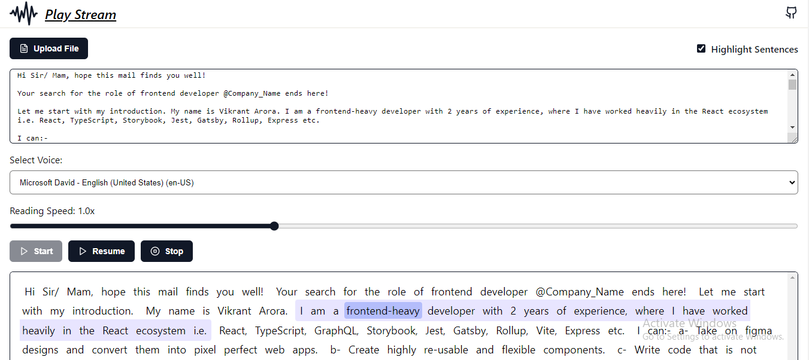

<kbd></kbd>

# Play Stream

**Play Stream** is an interactive, accessible text reader application that brings written content to life through advanced speech synthesis and visual highlighting. Perfect for auditory learners, individuals with visual impairments, or multitaskers. Play Stream offers a seamless blend of audio playback and synchronized text highlighting.

## ✨ Features

- **File Upload & Text Input**: Easily upload `.txt` files or input text directly.
- **Custom Voice Selection**: Automatically fetches available system voices, filtered by language (e.g., "en-US"). Select from a variety of voices to tailor your listening experience.
- **Adjustable Reading Speed**: Control the pace of reading with a slider that allows customization of speech rates from 0.5x to 2x.
- **Real-Time Highlighting**: As the app reads the text aloud, both the current word and the sentence being spoken are highlighted for easy tracking.
- **Playback Controls**: Users can pause, resume, or stop speech synthesis at any point without losing their place in the text.
- **Continuous Playback**: Ensures a seamless reading experience by keeping the current word and sentence in sync, even when changing voices or speed.
- **Smart Text Processing**: Efficiently splits text into words and sentences for accurate synchronization between spoken and highlighted content.
- **Cross-Browser Compatibility**: Designed to work smoothly across modern browsers with support for `speechSynthesis` API.

## 📦 Prerequisites

- A modern web browser with support for the `speechSynthesis` API.
- Internet connection (for initial load only).

## ⚙️ Usage

1. Open Play Stream in your web browser.
2. Upload a `.txt` file or manually input text into the text area.
3. Press **Play** to start reading, **Pause** to pause, **Resume** to continue, or **Stop** to end the reading.
4. Select a preferred voice from the dropdown menu.
5. Adjust the reading speed using the slider (0.5x to 2x speed).
6. Watch as Play Stream highlights the current spoken word and the entire sentence in real-time.
7. Adjust the voice or speed anytime during playback. The app will maintain sync with the current spoken word and sentence.

## 🎉 Contributing

Contributions, bug reports, and feature requests are welcome! Please feel free to open an issue or submit a pull request on the repository.

 

Made with ❤️ by Vikrant Arora in Kashipur, Uttarakhand ( India )
